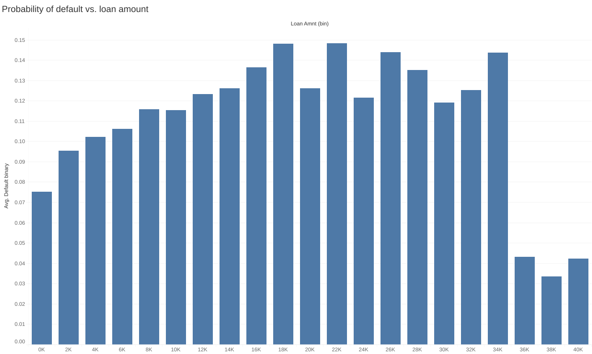
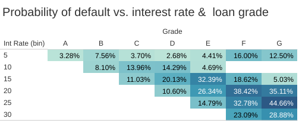
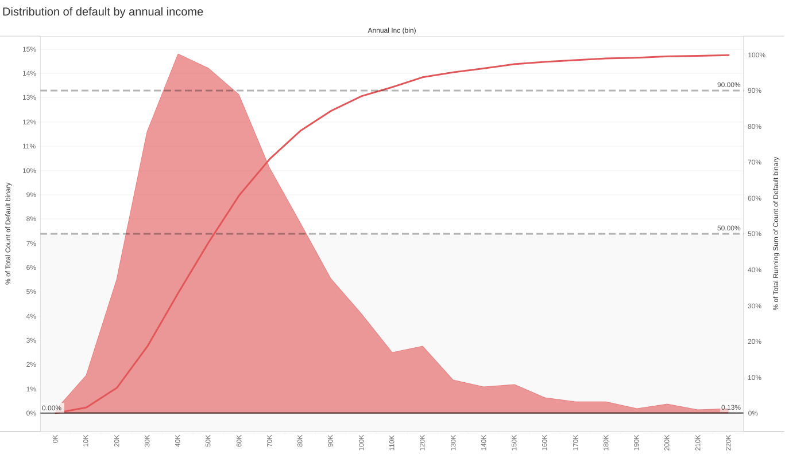
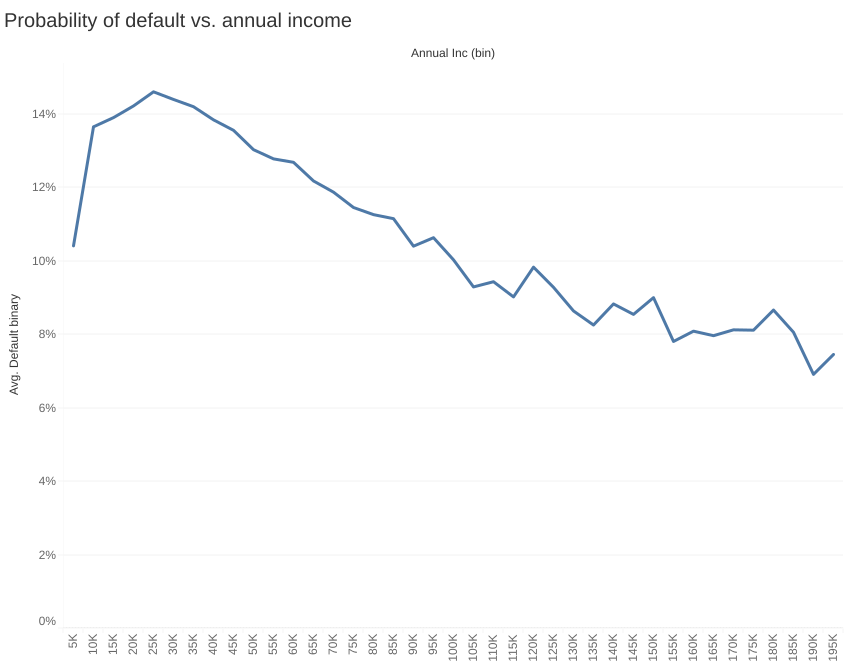
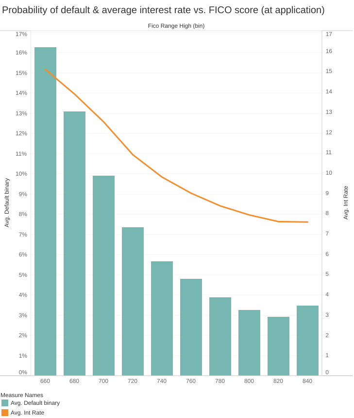
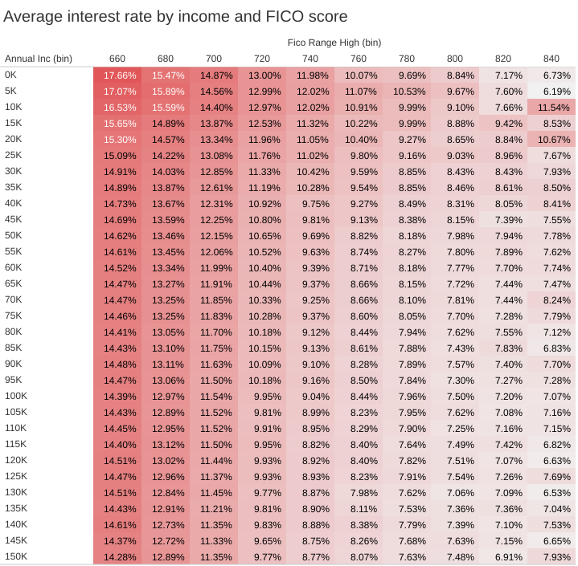

# Exploratory Data Analysis - FULL
# Introduction
LendingClub is a peer-to-peer loan platform that connects borrowers and investors, enabling individuals to obtain loans outside traditional banking channels.
# Data used
The data represents both accepted loans and rejected loans.

To reduce the influence of outliers and ensure reliable results, values for each dimension value are included in the analysis only when at least 30 observations are available for that specific dimension value.

For this project, it is essential to understand what each variable represents and when the information was recorded. In credit risk modelling, the timing of data collection is particularly important because only variables known at the time of the loan application can be used to predict default risk. Variables recorded after loan issuance may contain information about the future performance of the loan and can introduce data leakage, leading to overly optimistic model results. Therefore, distinguishing between borrower characteristics available before or at origination and variables generated during the life of the loan is a critical step to ensure a realistic and reliable analysis of default probability.

# Business understanding
When applying for a loan, the borrower submits financial and personal information that is used to assess credit risk. Based on this evaluation, the loan application can either be accepted or rejected:
1. Accepted
   1. Fully paid: The borrower has fully repaid the loan and its interests
   2. Current: The borrower is still paying the installments
   3. Charged off/default: The borrower has not paid their installments in the last 120 days. The loan has defaulted and the lender considers the installments unlikely to be repaid
2. Rejected
Based on this, Lending Club approves or rejects the loan. If the loan is 
Detailed explanations of the variables, their type, timing of recording etc. can be found in the [data dictionary](data_dictionary.csv).

Lending Club specializes in loans

## Probability of default (PD)
To estimate the probability of default for a group sharing a given characteristic, we can use the average of a binary default indicator. Because the default variable takes only two values (1 if the loan is in default or charged off, 0 otherwise), the arithmetic mean directly corresponds to the probability of default. In other words, the average represents the proportion of observations in the group that experienced default.

The probability of default of a given group is thus given by $PD = \frac{1}{n}\sum_{i=1}^{n} y_i$.

# Good loans versus bad loans
Since the dataset represents a snapshot of Lending Club loans at a given point in time, some loans may currently be classified as “late” even though they could eventually default in the future. As a result, defining bad loans solely as those already charged off may underestimate the true level of credit risk. Therefore, in this analysis, a bad loan is defined as a loan that has either already defaulted or is currently in late payment status, as these loans exhibit signs of repayment difficulty and elevated risk of future default.

# Results
## Uni-variate

## Multi-variate
First, we observe that loans appear to be correctly priced: higher interest rates are associated with higher probabilities of default, consistent with risk-based pricing.

## Loan amount
The amount that can be borrowed on Lending Club goes up to 40,000$

### Income
50% of defaults are caused by borrowers earning less than 50,000$ a year, and 90% by those earning less than 115,000$ year.

Income influences the probability of default because debt represents a larger financial burden for lower-income borrowers. However, this relationship must be interpreted in context. A borrower with low annual income and a large loan faces significantly greater repayment pressure than a borrower with low income but a smaller loan amount. For this reason, risk should be evaluated using relative measures such as the debt-to-income ratio rather than income alone.

Nonetheless, income still plays an important role even when debt-to-income ratio is similar. When two borrowers have the same debt-to-income ratio, the higher-income borrower often faces lower default risk. This is because essential living expenses do not increase proportionally with income — spending on necessities such as housing, food, and utilities does not scale one-to-one with earnings. As income rises, essential expenditures typically represent a smaller share of total income, leaving more disposable income available after covering basic costs. This additional financial flexibility provides a buffer against unexpected financial shocks and improves the ability to maintain loan repayments. Consequently, higher income generally reduces the probability of default even when debt-to-income ratios are comparable.

### FICO
Loans are priced correctly. As the FICO score decreases, the average interst rate increases accordingly.

FICO scores range from 300 to 850. In the dataset, there are two distinct FICO scores, the one at the date of loan application, and the most recent calculated FICO.

## Summary table
| Variable | Effect on PD | Interpretation |
|-|-|-|
| Annual income | high | higher income decreases PD up to a certain threshold |
| DTI | positive | higher leverage increases risk |
| FICO | high | higher score → lower risk |
| interest rate | positive | reflects risk pricing |

There is no magic variable that stands out as a unique identifier of high-risk borrowers.
# Loan pricing
The interest rates are risk-adjusted according to the risk represented by the borrower during the assessment phase. The riskier the borrower, the higher the interest rate. Interestingly, not all variables explored before are taken into account in the loan pricing.
# Next step
- Check multi-collinearity

  

### Interpretation
The graph shows that the probability of default increases as income decreases.

$$
PD = \frac{1}{n}\sum_{i=1}^{n} y_i
$$

  

  

    
  

