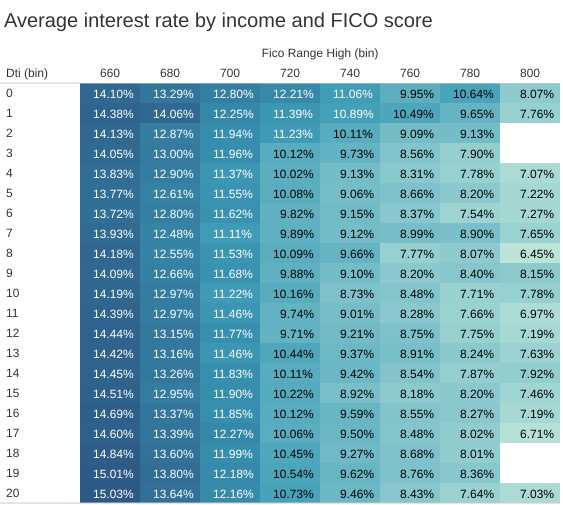

# Exploratory Data Analysis - FULL
# Introduction
LendingClub is a peer-to-peer loan platform that connects borrowers and investors, enabling individuals to obtain loans outside traditional banking channels.
# Data used
The data represents both accepted loans and rejected loans.

To reduce the influence of outliers and ensure reliable results, values for each dimension value are included in the analysis only when at least 30 observations are available for that specific dimension value.

# Results
First, we observe that loans appear to be correctly priced: higher interest rates are associated with higher probabilities of default, consistent with risk-based pricing.

## Annual income
50% of default are caused by borrowers earning less than 50,000 a year, and 90% by those earning less than 100,000.

Income affects

It is also important to note that no loans are issued to borrowers with a FICO score below 600. Additionally, the debt-to-income (DTI) ratio does not appear to significantly influence the interest rate at which loans are priced. This finding is plausible, as higher-income individuals can typically sustain higher levels of debt, since their essential expenses do not increase proportionally with income.

FICO scores range from 300 to 850. In the dataset, there are two distinct FICO scores, the one at the date of loan application, and the most recent calculated FICO.

Debt-to-income ratio also affects default probability, as debt burden increases

## Summary table
| Variable | Effect on PD | Interpretation |
|-|-|-|
| FICO | high | higher score → lower risk |
| interest rate | positive | reflects risk pricing |
| DTI | positive | higher leverage increases risk |  
| Annual income | high | higher income decreases PD up to a certain threshold |
# Next step
- Check multi-collinearity