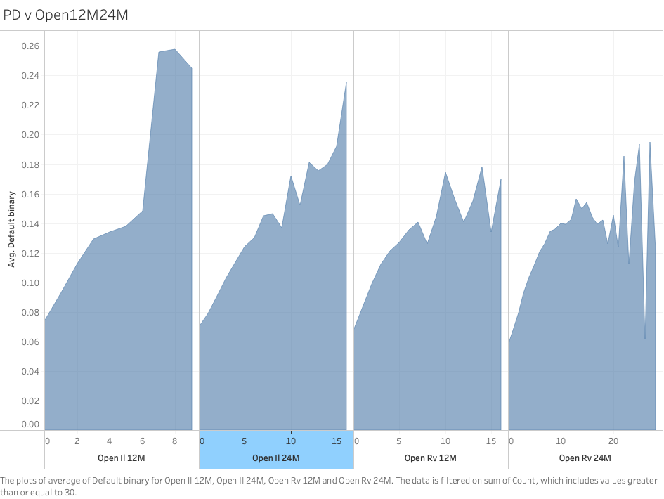

(...in progress...)
# 📑 Executive summary
This project explores Lending Club peer-to-peer loan data to identify the key factors influencing borrower risk, loan performance, and default probability. Using Tableau for the analysis uncovers patterns in credit characteristics, interest rates, and borrower profiles. 
Key profiles are : 
1. High credit score (FICO)
2. High number of revolving and installment accounts opened in the last 12 months
3. Debt to income ratio
# 🎯 Business objectives
Financial institutions need to accurately assess borrower risk to:
- minimize loan losses by identifying risky customer profiles 
- set the interest rate of loan accordingly
- maximize profit

Poor risk assessment thus leads to:
- higher default rates
- mispriced loans
- reduced profitability

## Key questions
- Which borrower characteristics are associated with higher default risk?
- Are interest rates aligned with borrower risk?
- Which loan segments contribute most to losses?
- How do income, credit score, and loan purpose affect repayment behavior?

# 🔬 Methodology
Exploratory data analysis was conducted in Tableau using dashboards, 
calculated fields, and segment-level comparisons to identify patterns in borrower behavior and loan outcomes.

# 🛠️ Skills
- Tableau
- Exploratory Data Analysis
- Data Visualization
- Risk Analysis
# 🔍 Findings & Recommendations
The analysis indicates that default risk is more strongly associated with weaker credit profiles, higher debt burdens, and signs of recent credit expansion. 

Lenders should pay particular attention to borrowers with lower credit scores, high debt-to-income ratios, and many recently opened accounts. 
These profiles may require stricter approval criteria or more risk-adjusted pricing.
# ⏭️ Next Steps
Develop predictive models, including logistic regression and machine learning classifiers, 
to estimate the probability of default more accurately at the loan application stage.
